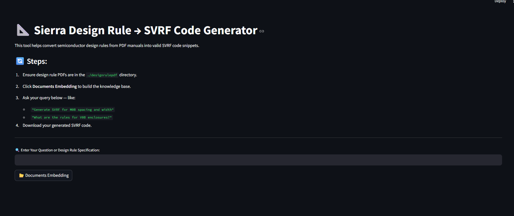

# 🔍 SVRF Code Generator for VLSI Design Rules

This project automates the translation of semiconductor design rules from PDF documents into **SVRF (Standard Verification Rule Format)** code using AI.

## 🚀 Features

- 📄 Upload a PDF containing design rules (e.g., FreePDK3)
- 🤖 Extract and interpret layer specifications using NVIDIA Embeddings
- 🔍 Query any layer rule and retrieve accurate SVRF code
- 🧠 Uses LLaMA3-70B with LangChain for natural language understanding
- 💾 Download the generated SVRF code directly from the interface

## 🧱 Architecture

1. Load PDF design rule manuals
2. Split content into text chunks
3. Generate embeddings using NVIDIA AI
4. Store in a FAISS vector database
5. Use LangChain to retrieve relevant text
6. Translate to SVRF code using a structured LLM prompt

## 📸 UI Preview

 <!-- Replace or remove if not available -->

## 🛠️ Tech Stack

- 🧠 [NVIDIA NeMo LLM API](https://developer.nvidia.com/nemo)
- 🔗 [LangChain](https://www.langchain.com/)
- 🧰 FAISS (Facebook AI Similarity Search)
- 🌐 Streamlit (Web UI)
- 📄 Python 3.10+

## 💻 How to Run

```bash
git clone https://github.com/Yaswanth-ampolu/svrf-code-gen.git
cd svrf-code-gen
python -m venv venv
source venv/bin/activate  # or venv\Scripts\activate on Windows
pip install -r requirements.txt
streamlit run svrfgpt.py
